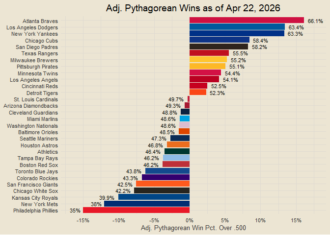
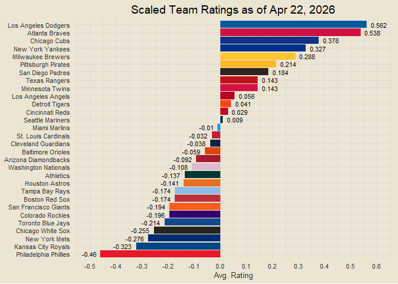
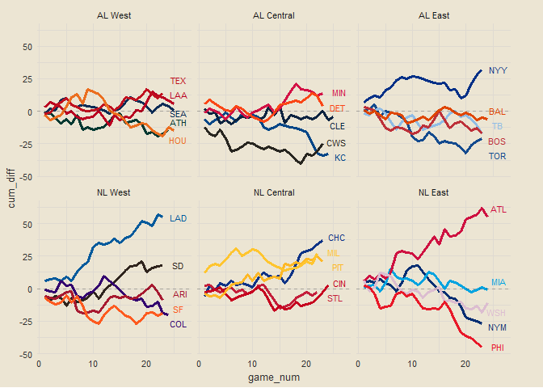
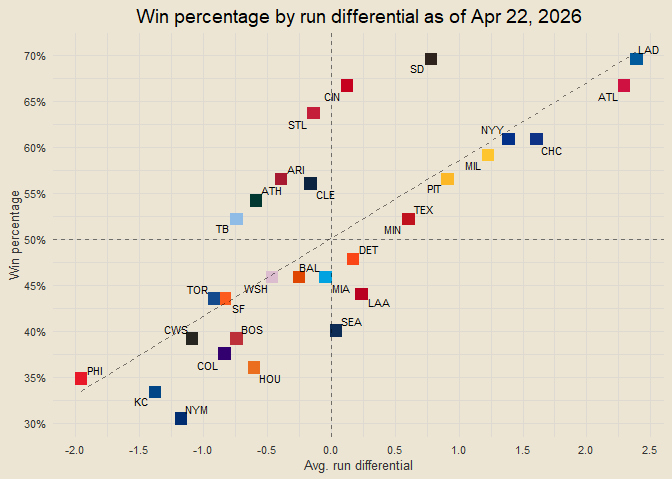
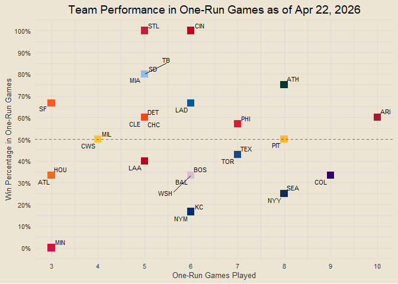

Chad’s 2026 MLB Report
================

*Interested in the underlying code that builds this report?* Check it
out on GitHub:
<a href="https://github.com/chadallison/mlb26" target="_blank">mlb26</a>

------------------------------------------------------------------------

### Contents

- [Team Standings](#team-standings)
- [Run Differentials](#run-differentials)
- [Runs Scored and Allowed per Game](#runs-scored-and-allowed-per-game)
- [Pythagorean Wins](#pythagorean-wins)
- [Adjusted Run Differentials](#adjusted-run-differentials)
- [Team NPR](#team-npr)
- [Adjusted Pythagorean Wins](#adjusted-pythagorean-wins)
- [Scaled Team Ratings](#scaled-team-ratings)
- [Cumulative Run Differentials](#cumulative-run-differentials)
- [Win Percentage by Run
  Differential](#win-percentage-by-run-differential)
- [One Run Games](#one-run-games)

------------------------------------------------------------------------

### Team Standings

<!-- -->

------------------------------------------------------------------------

### Run Differentials

<!-- -->

------------------------------------------------------------------------

### Runs Scored and Allowed per Game

<!-- -->

------------------------------------------------------------------------

### Pythagorean Wins

<!-- -->

------------------------------------------------------------------------

### Adjusted Run Differentials

<!-- -->

------------------------------------------------------------------------

### Team NPR

<!-- -->

------------------------------------------------------------------------

### Adjusted Pythagorean Wins

<!-- -->

------------------------------------------------------------------------

### Scaled Team Ratings

<!-- -->

------------------------------------------------------------------------

### Cumulative Run Differentials

<!-- -->

------------------------------------------------------------------------

### Win Percentage by Run Differential

<!-- -->

------------------------------------------------------------------------

### One Run Games

<!-- -->

------------------------------------------------------------------------
