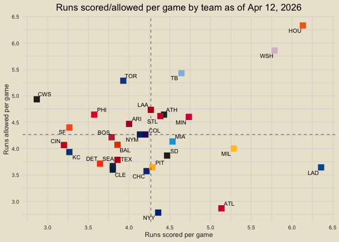
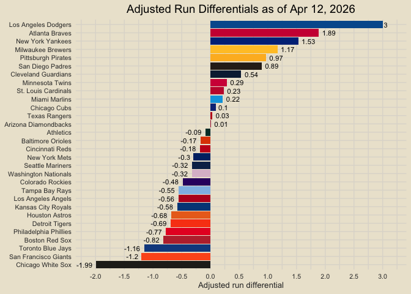
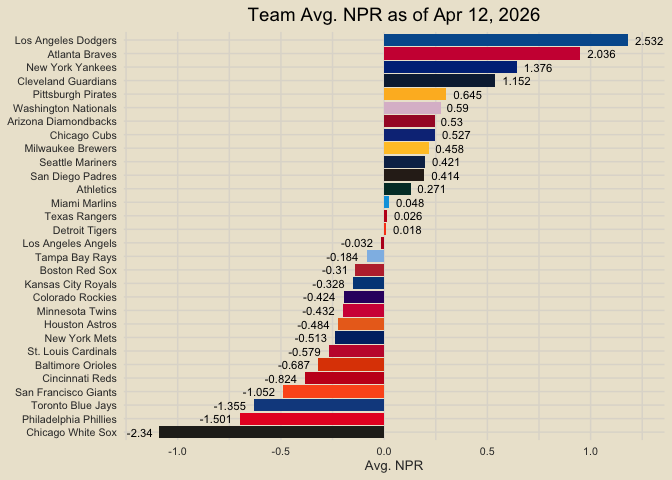

Chad’s 2026 MLB Report
================

<!-- *Interested in the underlying code that builds this report?* Check it out on GitHub: [mlb26](https://github.com/chadallison/mlb26){target="_blank"} -->

------------------------------------------------------------------------

### Contents

Nothing yet!

------------------------------------------------------------------------

``` r
all_results = end_games |>
  transmute(
    date, game_pk,
    team = home_team, opp = away_team,
    score = home_score, opp_score = away_score,
    is_win = ifelse(home_score > away_score, 1, 0)
  ) |>
  bind_rows(
    end_games |>
      transmute(
        date, game_pk,
        team = away_team, opp = home_team,
        score = away_score, opp_score = home_score,
        is_win = ifelse(away_score > home_score, 1, 0)
      )
  ) |>
  arrange(team, date)

team_records = all_results |>
  group_by(team) |>
  summarise(gp = n(),
            scored = sum(score),
            allowed = sum(opp_score),
            run_diff = sum(score) - sum(opp_score),
            wins = sum(is_win),
            losses = sum(1 - is_win),
            win_pct = mean(is_win)) |>
  mutate(record = paste0(wins, "-", losses)) |>
  inner_join(teams_info, by = "team")
```

``` r
team_records |>
  arrange(desc(win_pct), desc(run_diff), desc(scored), allowed, team) |>
  mutate(pct_vs_500 = win_pct - 0.5,
         pl = ifelse(pct_vs_500 >= 0, record, ""),
         nl = ifelse(pct_vs_500 < 0, record, ""),
         row_num = row_number()) |>
  ggplot(aes(reorder(team, -row_num), pct_vs_500)) +
  geom_col(aes(fill = hex)) +
  geom_text(aes(label = pl), hjust = -0.25, size = 3) +
  geom_text(aes(label = nl), hjust = 1.25, size = 3) +
  coord_flip() +
  scale_fill_identity() +
  labs(title = glue("Team Standings as of {today_nice}"),
       x = NULL, y = "Team win pct. over/under .500") +
  scale_y_continuous(
    breaks = seq(-0.5, 0.5, by = 0.1), labels = scales::percent,
    expand = expansion(mult = 0.1)
  )
```

<!-- -->

------------------------------------------------------------------------

``` r
plot_data = team_records |>
  mutate(run_diff_pg = round(run_diff / gp, 2)) |>
  arrange(desc(run_diff_pg), desc(scored), allowed, team) |>
  mutate(row_num = row_number(),
         pl = ifelse(run_diff_pg >= 0, run_diff_pg, ""),
         nl = ifelse(run_diff_pg < 0, run_diff_pg, ""))

plot_data |>
  ggplot(aes(reorder(team, -row_num), run_diff_pg)) +
  geom_col(aes(fill = hex)) +
  geom_text(aes(label = pl), hjust = -0.25, size = 3) +
  geom_text(aes(label = nl), hjust = 1.25, size = 3) +
  scale_fill_identity() +
  scale_y_continuous(breaks = seq(-10, 10, by = 0.5)) +
  coord_flip(ylim = c(min(plot_data$run_diff_pg) * 1.05, max(plot_data$run_diff_pg) * 1.05)) +
  labs(title = glue("Avg. Run Differentials as of {today_nice}"),
       x = NULL, y = "Avg. Run differential")
```

<!-- -->

``` r
team_rpg = all_results |>
  group_by(team) |>
  summarise(gp = n(),
            off_rpg = mean(score),
            def_rpg = mean(opp_score))

avg_runs = mean(all_results$score)

team_rpg |>
  inner_join(teams_info, by = "team") |>
  ggplot(aes(off_rpg, def_rpg)) +
  geom_point(aes(col = hex), shape = "square", size = 4) +
  ggrepel::geom_text_repel(aes(label = abb), size = 3, max.overlaps = 30) +
  scale_color_identity() +
  geom_vline(xintercept = avg_runs, linetype = "dashed", alpha = 0.5) +
  geom_hline(yintercept = avg_runs, linetype = "dashed", alpha = 0.5) +
  scale_x_continuous(breaks = seq(0, 100, by = 0.5)) +
  scale_y_continuous(breaks = seq(0, 100, by = 0.5)) +
  labs(x = "Runs scored per game",
       y = "Runs allowed per game",
       title = glue("Runs scored/allowed per game by team as of {today_nice}"))
```

<!-- -->

``` r
team_pythag = all_results |>
  group_by(team) |>
  summarise(scored = sum(score),
            allowed = sum(opp_score)) |>
  mutate(py = scored ^ 2 / (scored ^ 2 + allowed ^ 2),
         py_500 = py - 0.5)

team_pythag |>
  mutate_if(is.numeric, round, 3) |>
  mutate(py_lab = paste0(py * 100, "%")) |>
  inner_join(teams_info, by = "team") |>
  mutate(pl = ifelse(py_500 >= 0, py_lab, ""),
         nl = ifelse(py_500 < 0, py_lab, "")) |>
  ggplot(aes(reorder(team, py), py_500)) +
  geom_col(aes(fill = hex)) +
  geom_text(aes(label = pl), size = 3, hjust = -0.25) +
  geom_text(aes(label = nl), size = 3, hjust = 1.25) +
  coord_flip(ylim = c(min(team_pythag$py_500) * 1.1, max(team_pythag$py_500) * 1.1)) +
  scale_fill_identity() +
  labs(x = NULL, y = "Pythagorean win percentage vs. .500",
       title = "Team Pythagorean Wins") +
  scale_y_continuous(breaks = seq(-1, 1, by = 0.1), labels = scales::percent)
```

<!-- -->

``` r
plot_data = all_results |>
  mutate(raw_diff = score - opp_score,
         diff_sign = sign(raw_diff),
         abs_diff = abs(raw_diff),
         adj_abs_diff = sqrt(abs_diff),
         adj_diff = adj_abs_diff * diff_sign) |>
  group_by(team) |>
  summarise(gp = n(),
            total_adj_diff = sum(adj_diff),
            avg_adj_diff = mean(adj_diff)) |>
  mutate(scaled_diff = scale(avg_adj_diff),
         lab = round(scaled_diff, 2),
         pl = ifelse(scaled_diff >= 0, lab, ""),
         nl = ifelse(scaled_diff < 0, lab, "")) |>
  inner_join(teams_info, by = "team")

plot_data |>
  ggplot(aes(reorder(team, scaled_diff), scaled_diff)) +
  geom_col(aes(fill = hex)) +
  scale_fill_identity() +
  coord_flip(ylim = c(min(plot_data$scaled_diff) * 1.05, max(plot_data$scaled_diff) * 1.05)) +
  geom_text(aes(label = pl), size = 3, hjust = -0.25) +
  geom_text(aes(label = nl), size = 3, hjust = 1.25) +
  labs(x = NULL, y = "Adjusted run differential",
       title = glue("Adjusted Run Differentials as of {today_nice}")) +
  scale_y_continuous(breaks = seq(-3, 3, by = 0.5))
```

<!-- -->

``` r
end_with_npr = end_games |>
  inner_join(team_rpg, by = c("home_team" = "team")) |>
  rename(home_gp = gp, home_off_rpg = off_rpg, home_def_rpg = def_rpg) |>
  inner_join(team_rpg, by = c("away_team" = "team")) |>
  rename(away_gp = gp, away_off_rpg = off_rpg, away_def_rpg = def_rpg) |>
  mutate(home_exp = (home_off_rpg + away_def_rpg) / 2,
         away_exp = (away_off_rpg + home_def_rpg) / 2,
         home_off_npr = home_score - home_exp,
         home_def_npr = away_exp - away_score,
         away_off_npr = away_score - away_exp,
         away_def_npr = home_exp - home_score)

plot_data = end_with_npr |>
  select(date, team = home_team, opp = away_team, off_npr = home_off_npr, def_npr = home_def_npr) |>
  bind_rows(
    end_with_npr |>
      select(date, team = away_team, opp = home_team, off_npr = away_off_npr, def_npr = away_def_npr)
  ) |>
  arrange(team, date) |>
  group_by(team) |>
  summarise(gp = n(),
            net_off_npr = sum(off_npr),
            net_def_npr = sum(def_npr),
            net_ovr_npr = sum(off_npr) + sum(def_npr),
            avg_off_npr = mean(off_npr),
            avg_def_npr = mean(def_npr),
            avg_ovr_npr = mean(off_npr) + mean(def_npr)) |>
  mutate(avg_npr_scaled = scale(avg_ovr_npr),
         lab = round(avg_npr_scaled, 3),
         pl = ifelse(avg_npr_scaled >= 0, lab, ""),
         nl = ifelse(avg_npr_scaled < 0, lab, "")) |>
  inner_join(teams_info, by = "team")

plot_data |>
  ggplot(aes(reorder(team, avg_ovr_npr), avg_ovr_npr)) +
  geom_col(aes(fill = hex)) +
  scale_fill_identity() +
  coord_flip(ylim = c(min(plot_data$avg_ovr_npr) * 1.05, max(plot_data$avg_ovr_npr) * 1.05)) +
  geom_text(aes(label = pl), size = 3, hjust = -0.25) +
  geom_text(aes(label = nl), size = 3, hjust = 1.25) +
  labs(x = NULL, y = "Avg. NPR",
       title = glue("Team Avg. NPR as of {today_nice}")) +
  scale_y_continuous(breaks = seq(-5, 5, by = 0.5))
```

<!-- -->

``` r
all_results |>
  mutate(sc = sqrt(score),
         al = sqrt(opp_score)) |>
  group_by(team) |>
  summarise(sc = sum(sc),
            al = sum(al)) |>
  mutate(py = sc ^ 2 / (sc ^ 2 + al ^ 2),
         wins = round(py * 162, 1)) |>
  arrange(desc(py))
```

    ## # A tibble: 30 × 5
    ##    team                   sc    al    py  wins
    ##    <chr>               <dbl> <dbl> <dbl> <dbl>
    ##  1 Atlanta Braves       30.5  21.9 0.660 107  
    ##  2 New York Yankees     27.2  19.8 0.655 106  
    ##  3 Los Angeles Dodgers  33.6  25.8 0.629 102. 
    ##  4 San Diego Padres     30.3  26.3 0.569  92.2
    ##  5 Milwaukee Brewers    29.3  26.9 0.543  88  
    ##  6 Pittsburgh Pirates   26.0  24.6 0.528  85.6
    ##  7 Chicago Cubs         25.4  24.4 0.520  84.2
    ##  8 Boston Red Sox       26.4  25.4 0.519  84  
    ##  9 Los Angeles Angels   29.1  28.2 0.516  83.6
    ## 10 Minnesota Twins      30.7  30.0 0.512  82.9
    ## # ℹ 20 more rows
