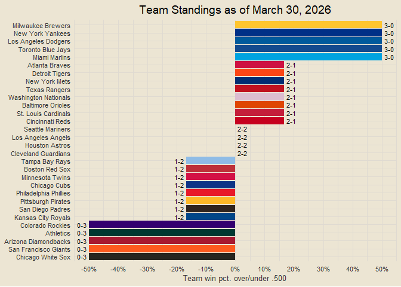
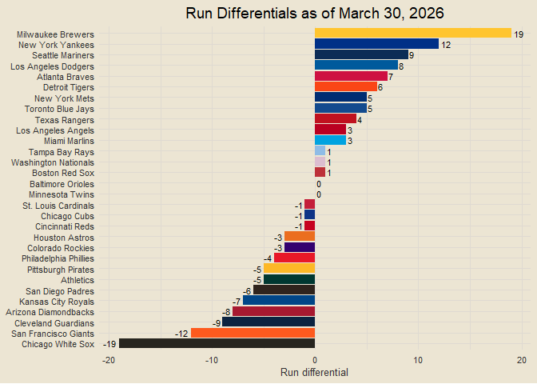
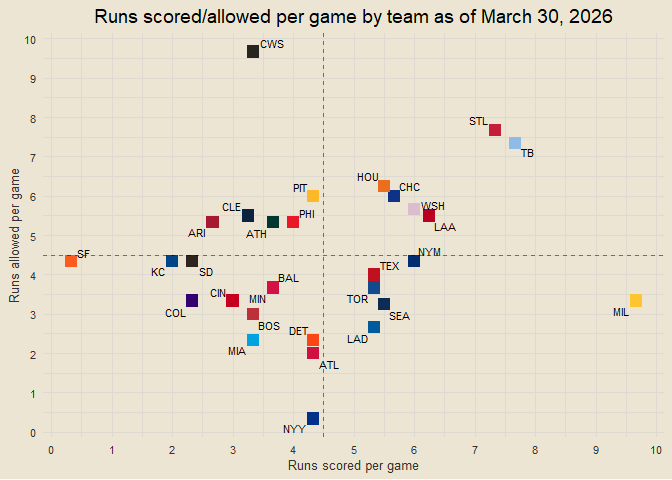

Chad’s 2026 MLB Report
================

<!-- *Interested in the underlying code that builds this report?* Check it out on GitHub: [mlb25](https://github.com/chadallison/mlb25){target="_blank"} -->

------------------------------------------------------------------------

### Contents

Nothing yet!

------------------------------------------------------------------------

``` r
all_results = end_games |>
  transmute(
    date, game_pk,
    team = home_team, opp = away_team,
    score = home_score, opp_score = away_score,
    is_win = ifelse(home_score > away_score, 1, 0)
  ) |>
  bind_rows(
    end_games |>
      transmute(
        date, game_pk,
        team = away_team, opp = home_team,
        score = away_score, opp_score = home_score,
        is_win = ifelse(away_score > home_score, 1, 0)
      )
  ) |>
  arrange(team, date)

team_records = all_results |>
  group_by(team) |>
  summarise(scored = sum(score),
            allowed = sum(opp_score),
            run_diff = sum(score) - sum(opp_score),
            wins = sum(is_win),
            losses = sum(1 - is_win),
            win_pct = mean(is_win)) |>
  mutate(record = paste0(wins, "-", losses)) |>
  inner_join(teams_info, by = "team")
```

``` r
team_records |>
  arrange(desc(win_pct), desc(run_diff), desc(scored), allowed, team) |>
  mutate(pct_vs_500 = win_pct - 0.5,
         pl = ifelse(pct_vs_500 >= 0, record, ""),
         nl = ifelse(pct_vs_500 < 0, record, ""),
         row_num = row_number()) |>
  ggplot(aes(reorder(team, -row_num), pct_vs_500)) +
  geom_col(aes(fill = hex)) +
  geom_text(aes(label = pl), hjust = -0.25, size = 3) +
  geom_text(aes(label = nl), hjust = 1.25, size = 3) +
  coord_flip() +
  scale_fill_identity() +
  labs(title = glue("Team Standings as of {today_nice}"),
       x = NULL, y = "Team win pct. over/under .500") +
  scale_y_continuous(breaks = seq(-0.5, 0.5, by = 0.1), labels = scales::percent)
```

<!-- -->

------------------------------------------------------------------------

``` r
team_records |>
  arrange(desc(run_diff), desc(scored), allowed, team) |>
  mutate(row_num = row_number(),
         pl = ifelse(run_diff >= 0, run_diff, ""),
         nl = ifelse(run_diff < 0, run_diff, "")) |>
  ggplot(aes(reorder(team, -row_num), run_diff)) +
  geom_col(aes(fill = hex)) +
  geom_text(aes(label = pl), hjust = -0.25, size = 3) +
  geom_text(aes(label = nl), hjust = 1.25, size = 3) +
  scale_fill_identity() +
  coord_flip() +
  labs(title = glue("Run Differentials as of {today_nice}"),
       x = NULL, y = "Run differential")
```

<!-- -->

``` r
# all_pbp = tibble()
all_pbp = read_parquet("data/all_pbp.parquet")

new_pbp = map_dfr(
  end_games$game_pk[!end_games$game_pk %in% all_pbp$game_pk],
  ~ tryCatch(
    mlb_pbp_diff(
      game_pk = .x,
      start_timecode = "01012026_000000",
      end_timecode = "12312026_235959"
    ),
    error = function(e) {
      message("Skipping game_pk ", .x, ": ", conditionMessage(e))
      NULL
    }
  )
)

all_pbp = bind_rows(all_pbp, new_pbp)
write_parquet(all_pbp, "data/all_pbp_temp.parquet")
invisible(file.remove("data/all_pbp.parquet"))
invisible(file.rename("data/all_pbp_temp.parquet", "data/all_pbp.parquet"))
```

``` r
team_rpg = all_results |>
  group_by(team) |>
  summarise(gp = n(),
            off_rpg = mean(score),
            def_rpg = mean(opp_score))

avg_runs = mean(all_results$score)

team_rpg |>
  inner_join(teams_info, by = "team") |>
  ggplot(aes(off_rpg, def_rpg)) +
  geom_point(aes(col = hex), shape = "square", size = 4) +
  ggrepel::geom_text_repel(aes(label = abb), size = 3, max.overlaps = 30) +
  scale_color_identity() +
  geom_vline(xintercept = avg_runs, linetype = "dashed", alpha = 0.5) +
  geom_hline(yintercept = avg_runs, linetype = "dashed", alpha = 0.5) +
  scale_x_continuous(breaks = seq(0, 100, by = 1)) +
  scale_y_continuous(breaks = seq(0, 100, by = 1)) +
  labs(x = "Runs scored per game",
       y = "Runs allowed per game",
       title = glue("Runs scored/allowed per game by team as of {today_nice}"))
```

<!-- -->
