Chad’s 2026 MLB Report
================

*Interested in the underlying code that builds this report?* Check it
out on GitHub:
<a href="https://github.com/chadallison/mlb26" target="_blank">mlb26</a>

------------------------------------------------------------------------

### Contents

- [Team Standings](#team-standings)
- [Run Differentials](#run-differentials)
- [Runs Scored and Allowed per Game](#runs-scored-and-allowed-per-game)
- [Pythagorean Wins](#pythagorean-wins)
- [Adjusted Run Differentials](#adjusted-run-differentials)
- [Team NPR](#team-npr)
- [Adjusted Pythagorean Wins](#adjusted-pythagorean-wins)
- [Scaled Team Ratings](#scaled-team-ratings)
- [Cumulative Run Differentials](#cumulative-run-differentials)
- [Win Percentage by Run
  Differential](#win-percentage-by-run-differential)
- [One Run Games](#one-run-games)
- [True vs Adjusted Run
  Differentials](#true-vs-adjusted-run-differentials)
- [Blowout-Adjusted Cumulative Run
  Differentials](#blowout-adjusted-cumulative-run-differentials)
- [Records vs Winning Record Teams](#records-vs-winning-record-teams)

------------------------------------------------------------------------

### Team Standings

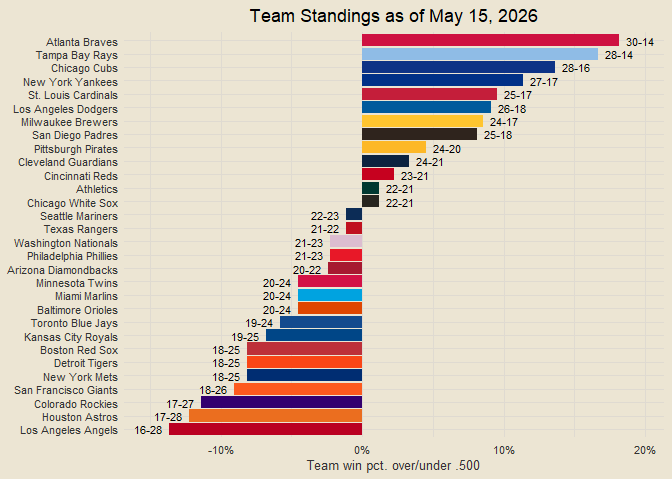<!-- -->

------------------------------------------------------------------------

### Run Differentials

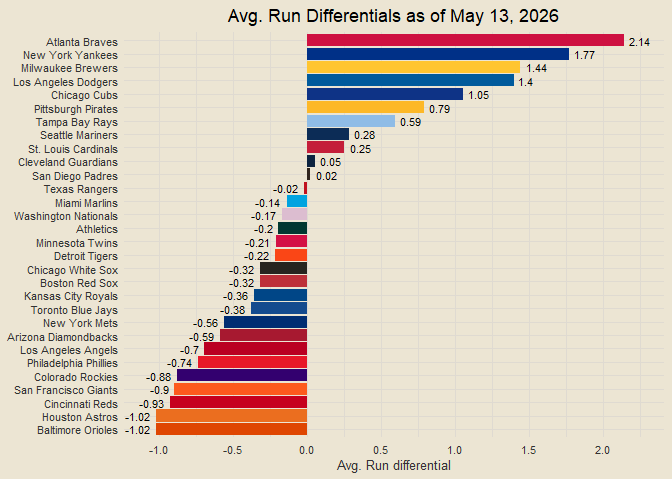<!-- -->

------------------------------------------------------------------------

### Runs Scored and Allowed per Game

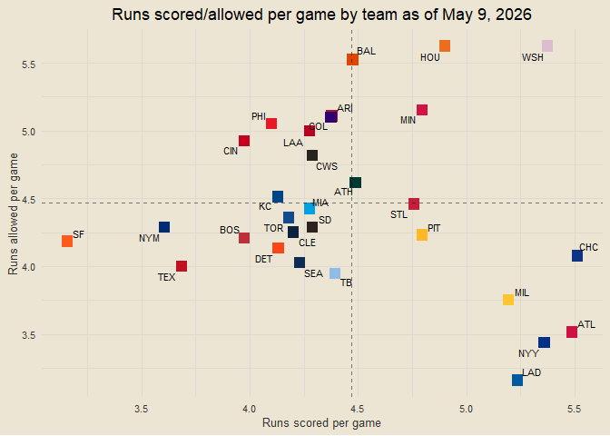<!-- -->

------------------------------------------------------------------------

### Pythagorean Wins

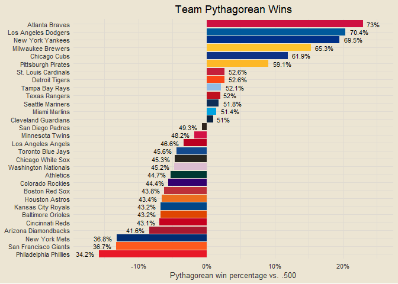<!-- -->

------------------------------------------------------------------------

### Adjusted Run Differentials

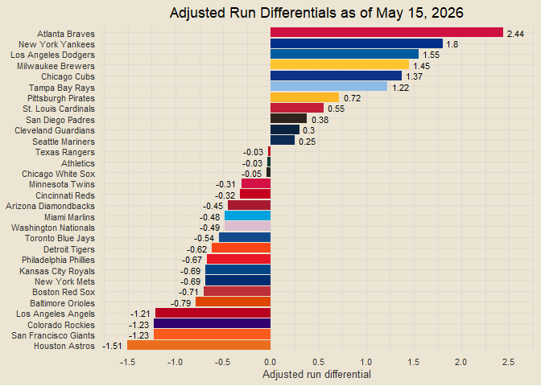<!-- -->

------------------------------------------------------------------------

### Team NPR

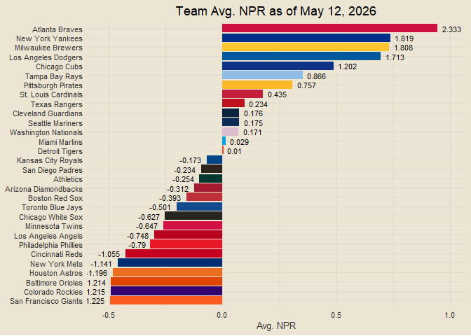<!-- -->

------------------------------------------------------------------------

### Adjusted Pythagorean Wins

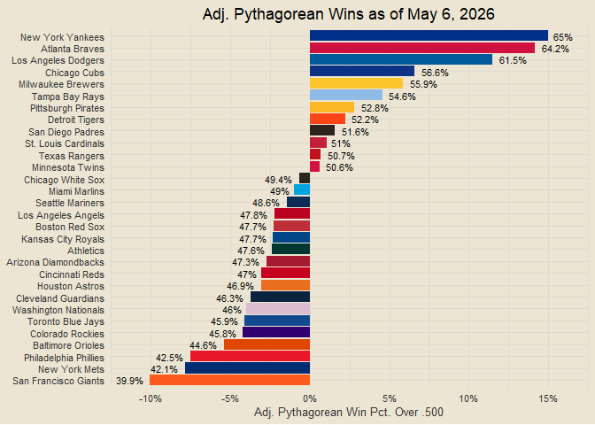<!-- -->

------------------------------------------------------------------------

### Scaled Team Ratings

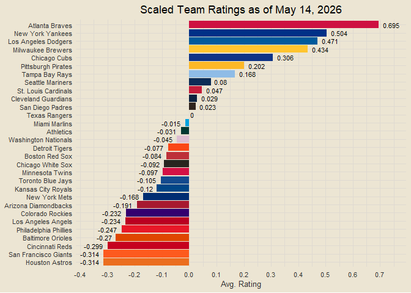<!-- -->

------------------------------------------------------------------------

### Cumulative Run Differentials

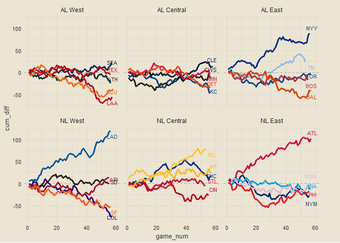<!-- -->

------------------------------------------------------------------------

### Win Percentage by Run Differential

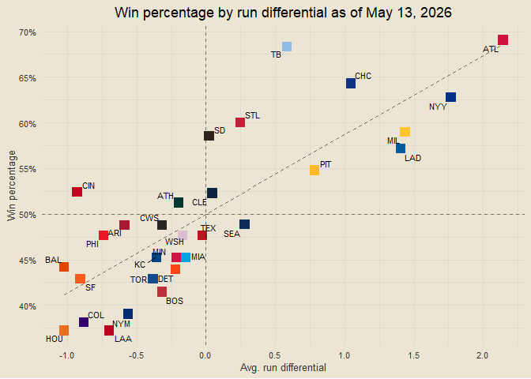<!-- -->

------------------------------------------------------------------------

### One Run Games

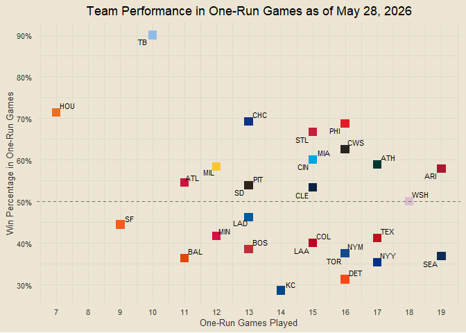<!-- -->

------------------------------------------------------------------------

### True vs Adjusted Run Differentials

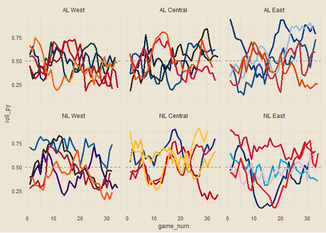<!-- -->

------------------------------------------------------------------------

### Blowout-Adjusted Cumulative Run Differentials

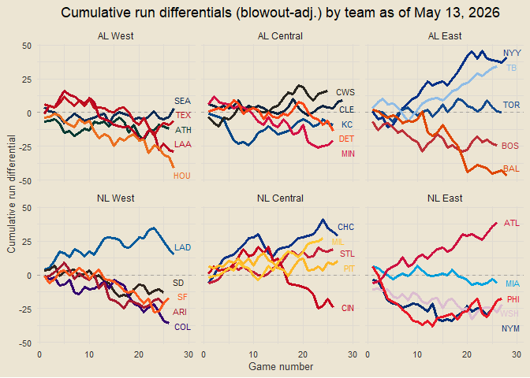<!-- -->

------------------------------------------------------------------------

### Records vs Winning Record Teams

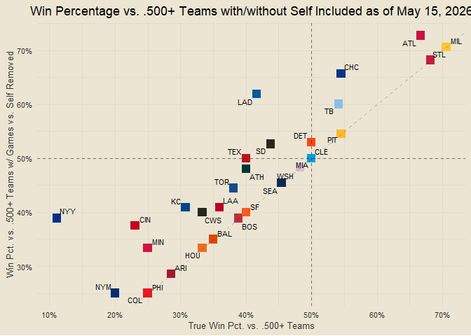<!-- -->

------------------------------------------------------------------------

``` r
all_results |>
  mutate(diff = score - opp_score) |>
  group_by(diff) |>
  count(team, name = "cnt") |>
  slice_max(cnt, n = 1, with_ties = T) |>
  summarise(cnt = first(cnt), team = paste(team, collapse = ", ")) |>
  mutate(clean_diff = ifelse(diff > 0, paste0(diff, "-run victory"), paste0(abs(diff), "-run defeat")),
         str = paste0(clean_diff, ": ", team, " (", cnt, ")")) |>
  distinct(str) |>
  pull(str)
```

    ##  [1] "16-run defeat: Baltimore Orioles (1)"                                                                                                                                
    ##  [2] "15-run defeat: Arizona Diamondbacks (1)"                                                                                                                             
    ##  [3] "14-run defeat: Washington Nationals (1)"                                                                                                                             
    ##  [4] "13-run defeat: Los Angeles Angels, Minnesota Twins (1)"                                                                                                              
    ##  [5] "12-run defeat: Arizona Diamondbacks, Chicago White Sox, Cleveland Guardians, New York Mets, Toronto Blue Jays (1)"                                                   
    ##  [6] "11-run defeat: Philadelphia Phillies (2)"                                                                                                                            
    ##  [7] "10-run defeat: Cincinnati Reds (2)"                                                                                                                                  
    ##  [8] "9-run defeat: Colorado Rockies, Philadelphia Phillies (2)"                                                                                                           
    ##  [9] "8-run defeat: Houston Astros, Washington Nationals (3)"                                                                                                              
    ## [10] "7-run defeat: Boston Red Sox (5)"                                                                                                                                    
    ## [11] "6-run defeat: San Diego Padres (6)"                                                                                                                                  
    ## [12] "5-run defeat: Houston Astros, Washington Nationals (6)"                                                                                                              
    ## [13] "4-run defeat: Minnesota Twins, San Francisco Giants (5)"                                                                                                             
    ## [14] "3-run defeat: Toronto Blue Jays (7)"                                                                                                                                 
    ## [15] "2-run defeat: Houston Astros (8)"                                                                                                                                    
    ## [16] "1-run defeat: Seattle Mariners (11)"                                                                                                                                 
    ## [17] "1-run victory: Chicago Cubs, Philadelphia Phillies, St. Louis Cardinals, Tampa Bay Rays (9)"                                                                         
    ## [18] "2-run victory: Baltimore Orioles, Cleveland Guardians (9)"                                                                                                           
    ## [19] "3-run victory: Texas Rangers (8)"                                                                                                                                    
    ## [20] "4-run victory: Tampa Bay Rays (5)"                                                                                                                                   
    ## [21] "5-run victory: Atlanta Braves (6)"                                                                                                                                   
    ## [22] "6-run victory: Los Angeles Dodgers, Minnesota Twins (4)"                                                                                                             
    ## [23] "7-run victory: Baltimore Orioles, Houston Astros, New York Yankees (3)"                                                                                              
    ## [24] "8-run victory: Chicago Cubs, Cleveland Guardians, Los Angeles Angels, Minnesota Twins, New York Mets, New York Yankees, Seattle Mariners (2)"                        
    ## [25] "9-run victory: Arizona Diamondbacks, Atlanta Braves, Chicago Cubs, Colorado Rockies, Los Angeles Dodgers, New York Mets, New York Yankees, Philadelphia Phillies (1)"
    ## [26] "10-run victory: Pittsburgh Pirates (2)"                                                                                                                              
    ## [27] "11-run victory: Athletics, Colorado Rockies, Houston Astros, Kansas City Royals, Milwaukee Brewers, New York Yankees, Pittsburgh Pirates, Washington Nationals (1)"  
    ## [28] "12-run victory: Milwaukee Brewers (2)"                                                                                                                               
    ## [29] "13-run victory: Toronto Blue Jays, Washington Nationals (1)"                                                                                                         
    ## [30] "14-run victory: Cincinnati Reds (1)"                                                                                                                                 
    ## [31] "15-run victory: Atlanta Braves (1)"                                                                                                                                  
    ## [32] "16-run victory: Boston Red Sox (1)"
