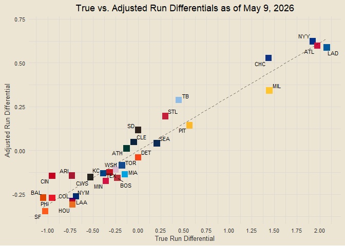
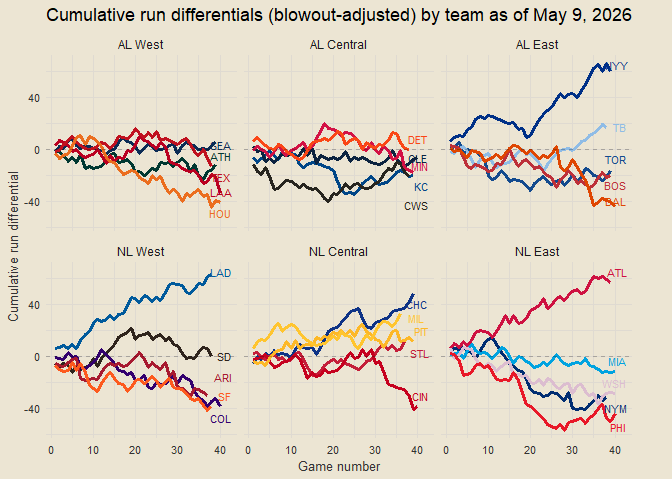

Chad’s 2026 MLB Report
================

*Interested in the underlying code that builds this report?* Check it
out on GitHub:
<a href="https://github.com/chadallison/mlb26" target="_blank">mlb26</a>

------------------------------------------------------------------------

### Contents

- [Team Standings](#team-standings)
- [Run Differentials](#run-differentials)
- [Runs Scored and Allowed per Game](#runs-scored-and-allowed-per-game)
- [Pythagorean Wins](#pythagorean-wins)
- [Adjusted Run Differentials](#adjusted-run-differentials)
- [Team NPR](#team-npr)
- [Adjusted Pythagorean Wins](#adjusted-pythagorean-wins)
- [Scaled Team Ratings](#scaled-team-ratings)
- [Cumulative Run Differentials](#cumulative-run-differentials)
- [Win Percentage by Run
  Differential](#win-percentage-by-run-differential)
- [One Run Games](#one-run-games)

------------------------------------------------------------------------

### Team Standings

<!-- -->

------------------------------------------------------------------------

### Run Differentials

<!-- -->

------------------------------------------------------------------------

### Runs Scored and Allowed per Game

<!-- -->

------------------------------------------------------------------------

### Pythagorean Wins

<!-- -->

------------------------------------------------------------------------

### Adjusted Run Differentials

<!-- -->

------------------------------------------------------------------------

### Team NPR

<!-- -->

------------------------------------------------------------------------

### Adjusted Pythagorean Wins

<!-- -->

------------------------------------------------------------------------

### Scaled Team Ratings

<!-- -->

------------------------------------------------------------------------

### Cumulative Run Differentials

<!-- -->

------------------------------------------------------------------------

### Win Percentage by Run Differential

<!-- -->

------------------------------------------------------------------------

### One Run Games

<!-- -->

------------------------------------------------------------------------

``` r
window_size = 7

all_results |>
  arrange(team, date, game_pk) |>
  mutate(roll_score = rollapply(score, width = window_size, align = "right", FUN = "sum", fill = NA),
         roll_allow = rollapply(opp_score, width = window_size, align = "right", FUN = "sum", fill = NA),
         .by = "team") |>
  filter(!is.na(roll_score)) |>
  mutate(game_num = row_number(), .by = "team") |>
  mutate(roll_py = roll_score ^ 2 / (roll_score ^ 2 + roll_allow ^ 2)) |>
  inner_join(teams_info, by = "team") |>
  inner_join(team_divisons, by = "team") |>
  ggplot(aes(game_num, roll_py)) +
  geom_line(aes(col = hex), linewidth = 1.25) +
  scale_color_identity() +
  geom_hline(yintercept = 0.5, linetype = "dashed", alpha = 0.5) +
  facet_wrap(vars(division))
```

<!-- -->

``` r
window_size = 7

all_results |>
  arrange(team, date, game_pk) |>
  mutate(diff_sr = sqrt(score) - sqrt(opp_score)) |>
  mutate(game_num = row_number(),
         roll_diff = rollapply(diff_sr, FUN = "sum", width = window_size, align = "right", partial = T),
         .by = "team") |>
  inner_join(teams_info, by = "team") |>
  inner_join(team_divisons, by = "team") |>
  ggplot(aes(game_num, roll_diff)) +
  geom_line(aes(col = hex), linewidth = 1.25) +
  geom_hline(yintercept = 0, linetype = "dashed", alpha = 0.25) +
  scale_color_identity() +
  facet_wrap(vars(division))
```

<!-- -->

``` r
all_res_npr = end_with_npr |>
  select(date, game_pk, team = home_team, opp = away_team, off_npr = home_off_npr, def_npr = home_def_npr) |>
  bind_rows(
    end_with_npr |>
      select(date, game_pk, team = away_team, opp = home_team, off_npr = away_off_npr, def_npr = away_def_npr)
  ) |>
  arrange(team, date, game_pk)

all_res_npr |>
  mutate(game_num = row_number(),
         roll_off = rollapply(off_npr, FUN = "mean", width = window_size, align = "right", partial = T),
         roll_def = rollapply(def_npr, FUN = "mean", width = window_size, align = "right", partial = T),
         roll_npr = roll_off + roll_def,
         .by = "team") |>
  inner_join(teams_info, by = "team") |>
  inner_join(team_divisons, by = "team") |>
  ggplot(aes(game_num, roll_npr)) +
  geom_line(aes(col = hex), linewidth = 1.25) +
  scale_color_identity() +
  facet_wrap(vars(division)) +
  geom_hline(yintercept = 0, linetype = "dashed", alpha = 0.5)
```

<!-- -->

``` r
all_results |>
  mutate(diff = abs(score - opp_score),
         real_diff = score - opp_score,
         log_diff = log(diff + 1),
         adj_diff = ifelse(score > opp_score, log_diff, -1 * log_diff)) |>
  group_by(team) |>
  summarise(adj_diff = mean(adj_diff),
            real_diff = mean(real_diff)) |>
  arrange(desc(adj_diff)) |>
  inner_join(teams_info, by = "team") |>
  ggplot(aes(real_diff, adj_diff)) +
  geom_point(aes(col = hex), shape = "square", size = 4) +
  scale_color_identity() +
  geom_line(
    stat = "smooth",
    formula = y ~ x,
    method = "lm",
    linetype = "dashed",
    alpha = 0.5
  ) +
  ggrepel::geom_text_repel(aes(label = abb), size = 3, max.overlaps = 30) +
  scale_x_continuous(breaks = seq(-5, 5, by = 0.25)) +
  scale_y_continuous(breaks = seq(-5, 5, by = 0.25)) +
  labs(x = "True Run Differential",
       y = "Adjusted Run Differential",
       title = glue("True vs. Adjusted Run Differentials as of {today_nice}"))
```

<!-- -->

``` r
all_results |>
  mutate(adj_diff = ifelse(
    score > opp_score,
    log(abs(score - opp_score) + 1),
    -1 * log(abs(score - opp_score) + 1)
  )) |>
  mutate(game_num = row_number(),
         games_played = n(),
         last_seven = ifelse(game_num > n() - 7, T, F),
         .by = "team") |>
  group_by(team) |>
  filter(last_seven) |>
  summarise(adj_diff = sum(adj_diff))
```

    ## # A tibble: 30 × 2
    ##    team                 adj_diff
    ##    <chr>                   <dbl>
    ##  1 Arizona Diamondbacks    -5.46
    ##  2 Athletics               -1.35
    ##  3 Atlanta Braves           2.60
    ##  4 Baltimore Orioles       -6.47
    ##  5 Boston Red Sox           1.39
    ##  6 Chicago Cubs             7.27
    ##  7 Chicago White Sox        2.86
    ##  8 Cincinnati Reds         -9.16
    ##  9 Cleveland Guardians      1.41
    ## 10 Colorado Rockies        -7.47
    ## # ℹ 20 more rows

``` r
max_diff = end_games |>
  mutate(diff = abs(win_score - lose_score)) |>
  summarise(avg_diff = mean(diff),
            sd_diff = sd(diff),
            max_diff = round(mean(diff) + sd(diff), 0)) |>
  pull(max_diff)

all_results |>
  mutate(diff = score - opp_score,
         diff = ifelse(diff > max_diff, max_diff, diff)) |>
  arrange(team, date, game_pk) |>
  mutate(game_num = row_number(),
         cum_adj_diff = cumsum(diff),
         .by = "team") |>
  inner_join(teams_info, by = "team") |>
  inner_join(team_divisons, by = "team") |>
  ggplot(aes(game_num, cum_adj_diff)) +
  geom_line(aes(col = hex), linewidth = 1.25) +
  geom_text_repel(
    data = ~ slice_max(.x, game_num, by = team),
    aes(label = abb, col = hex),
    nudge_x = 2,
    direction = "y",
    hjust = 0,
    size = 3,
    segment.size = 0,
    min.segment.length = 100
  ) +
  geom_hline(yintercept = 0, linetype = "dashed", alpha = 0.25) +
  scale_color_identity() +
  facet_wrap(vars(division)) +
  coord_cartesian(clip = "off") +
  theme(plot.margin = margin(5, 30, 5, 5)) +
  labs(x = "Game number",
       y = "Cumulative run differential",
       title = glue("Cumulative run differentials (blowout-adjusted) by team as of {today_nice}"))
```

<!-- -->

``` r
wins = end_games |>
  filter(win_score - lose_score > 1) |>
  count(team = win_team, name = "wins")

losses = end_games |>
  filter(win_score - lose_score > 1) |>
  count(team = lose_team, name = "losses")

full_join(x = wins, y = losses, by = "team") |>
  mutate(wins = coalesce(wins, 0),
         losses = coalesce(losses, 0),
         gp = wins + losses,
         win_pct = wins / gp) |>
  arrange(desc(win_pct))
```

    ## # A tibble: 30 × 5
    ##    team                 wins losses    gp win_pct
    ##    <chr>               <dbl>  <dbl> <dbl>   <dbl>
    ##  1 New York Yankees       23      6    29   0.793
    ##  2 Atlanta Braves         23      9    32   0.719
    ##  3 Los Angeles Dodgers    18      8    26   0.692
    ##  4 Chicago Cubs           17     10    27   0.630
    ##  5 San Diego Padres       17     11    28   0.607
    ##  6 Tampa Bay Rays         17     11    28   0.607
    ##  7 Milwaukee Brewers      17     12    29   0.586
    ##  8 Pittsburgh Pirates     15     12    27   0.556
    ##  9 St. Louis Cardinals    14     12    26   0.538
    ## 10 Cleveland Guardians    17     15    32   0.531
    ## # ℹ 20 more rows
