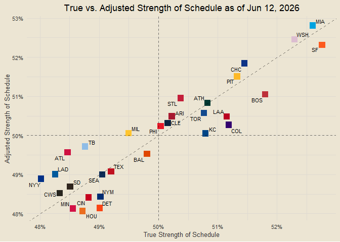

Chad’s 2026 MLB Report
================

*Interested in the underlying code that builds this report?* Check it
out on GitHub:
<a href="https://github.com/chadallison/mlb26" target="_blank">mlb26</a>

------------------------------------------------------------------------

### Contents

- [Team Standings](#team-standings)
- [Run Differentials](#run-differentials)
- [Runs Scored and Allowed per Game](#runs-scored-and-allowed-per-game)
- [Pythagorean Wins](#pythagorean-wins)
- [Adjusted Run Differentials](#adjusted-run-differentials)
- [Team NPR](#team-npr)
- [Adjusted Pythagorean Wins](#adjusted-pythagorean-wins)
- [Scaled Team Ratings](#scaled-team-ratings)
- [Cumulative Run Differentials](#cumulative-run-differentials)
- [Win Percentage by Run
  Differential](#win-percentage-by-run-differential)
- [One Run Games](#one-run-games)
- [True vs Adjusted Run
  Differentials](#true-vs-adjusted-run-differentials)
- [Blowout-Adjusted Cumulative Run
  Differentials](#blowout-adjusted-cumulative-run-differentials)
- [Records vs Winning Record Teams](#records-vs-winning-record-teams)

------------------------------------------------------------------------

### Team Standings

<!-- -->

------------------------------------------------------------------------

### Run Differentials

<!-- -->

------------------------------------------------------------------------

### Runs Scored and Allowed per Game

<!-- -->

------------------------------------------------------------------------

### Pythagorean Wins

<!-- -->

------------------------------------------------------------------------

### Adjusted Run Differentials

<!-- -->

------------------------------------------------------------------------

### Team NPR

<!-- -->

------------------------------------------------------------------------

### Adjusted Pythagorean Wins

<!-- -->

------------------------------------------------------------------------

### Scaled Team Ratings

<!-- -->

------------------------------------------------------------------------

### Cumulative Run Differentials

<!-- -->

------------------------------------------------------------------------

### Win Percentage by Run Differential

<!-- -->

------------------------------------------------------------------------

### One Run Games

<!-- -->

------------------------------------------------------------------------

### True vs Adjusted Run Differentials

<!-- -->

------------------------------------------------------------------------

### Blowout-Adjusted Cumulative Run Differentials

<!-- -->

------------------------------------------------------------------------

### Records vs Winning Record Teams

<!-- -->

------------------------------------------------------------------------

``` r
all_results |>
  mutate(diff = score - opp_score) |>
  group_by(diff) |>
  count(team, name = "cnt") |>
  slice_max(cnt, n = 1, with_ties = T) |>
  summarise(cnt = first(cnt), team = paste(team, collapse = ", ")) |>
  mutate(clean_diff = ifelse(diff > 0, paste0(diff, "-run victory"), paste0(abs(diff), "-run defeat")),
         str = paste0(clean_diff, ": ", team, " (", cnt, ")")) |>
  distinct(str) |>
  pull(str)
```

    ##  [1] "21-run defeat: Kansas City Royals (1)"                                                                                                                                  
    ##  [2] "20-run defeat: San Diego Padres (1)"                                                                                                                                    
    ##  [3] "19-run defeat: Athletics (1)"                                                                                                                                           
    ##  [4] "17-run defeat: Kansas City Royals (1)"                                                                                                                                  
    ##  [5] "16-run defeat: Baltimore Orioles, Chicago Cubs (1)"                                                                                                                     
    ##  [6] "15-run defeat: Arizona Diamondbacks, Chicago Cubs (1)"                                                                                                                  
    ##  [7] "14-run defeat: Washington Nationals (2)"                                                                                                                                
    ##  [8] "13-run defeat: Los Angeles Angels, Minnesota Twins (2)"                                                                                                                 
    ##  [9] "12-run defeat: New York Mets (3)"                                                                                                                                       
    ## [10] "11-run defeat: Athletics (3)"                                                                                                                                           
    ## [11] "10-run defeat: Chicago White Sox, San Francisco Giants (3)"                                                                                                             
    ## [12] "9-run defeat: Colorado Rockies (4)"                                                                                                                                     
    ## [13] "8-run defeat: Athletics, Colorado Rockies, Houston Astros (5)"                                                                                                          
    ## [14] "7-run defeat: Boston Red Sox, Cincinnati Reds (7)"                                                                                                                      
    ## [15] "6-run defeat: San Diego Padres (7)"                                                                                                                                     
    ## [16] "5-run defeat: Cincinnati Reds, Washington Nationals (10)"                                                                                                               
    ## [17] "4-run defeat: St. Louis Cardinals (14)"                                                                                                                                 
    ## [18] "3-run defeat: Miami Marlins, Toronto Blue Jays (13)"                                                                                                                    
    ## [19] "2-run defeat: Colorado Rockies (18)"                                                                                                                                    
    ## [20] "1-run defeat: Detroit Tigers, Los Angeles Angels, New York Mets, San Francisco Giants (20)"                                                                             
    ## [21] "1-run victory: Chicago White Sox (21)"                                                                                                                                  
    ## [22] "2-run victory: Houston Astros (21)"                                                                                                                                     
    ## [23] "3-run victory: Tampa Bay Rays (15)"                                                                                                                                     
    ## [24] "4-run victory: Arizona Diamondbacks, Miami Marlins (10)"                                                                                                                
    ## [25] "5-run victory: Chicago Cubs (10)"                                                                                                                                       
    ## [26] "6-run victory: Los Angeles Dodgers, Milwaukee Brewers, Pittsburgh Pirates (8)"                                                                                          
    ## [27] "7-run victory: St. Louis Cardinals (5)"                                                                                                                                 
    ## [28] "8-run victory: Seattle Mariners (5)"                                                                                                                                    
    ## [29] "9-run victory: Los Angeles Dodgers (5)"                                                                                                                                 
    ## [30] "10-run victory: Pittsburgh Pirates, Texas Rangers (3)"                                                                                                                  
    ## [31] "11-run victory: Detroit Tigers, Houston Astros, Pittsburgh Pirates (2)"                                                                                                 
    ## [32] "12-run victory: Los Angeles Dodgers, Milwaukee Brewers (2)"                                                                                                             
    ## [33] "13-run victory: Chicago White Sox, San Francisco Giants, Washington Nationals (2)"                                                                                      
    ## [34] "14-run victory: Athletics, Atlanta Braves, Chicago Cubs, Cincinnati Reds, Colorado Rockies, Detroit Tigers, Kansas City Royals, Milwaukee Brewers, New York Yankees (1)"
    ## [35] "15-run victory: Atlanta Braves, San Francisco Giants (1)"                                                                                                               
    ## [36] "16-run victory: Boston Red Sox, St. Louis Cardinals (1)"                                                                                                                
    ## [37] "17-run victory: San Diego Padres (1)"                                                                                                                                   
    ## [38] "19-run victory: Washington Nationals (1)"                                                                                                                               
    ## [39] "20-run victory: Chicago Cubs (1)"                                                                                                                                       
    ## [40] "21-run victory: Chicago White Sox (1)"

------------------------------------------------------------------------

### True vs Adjusted Strength of Schedule

<!-- -->

*Adjusted strength of schedule removes a team from its opponent’s pool
of games. For example, when calculating the Cubs’ adjusted SOS, it is
the average win percentage of their opponents with all games against the
Cubs removed.*

------------------------------------------------------------------------
